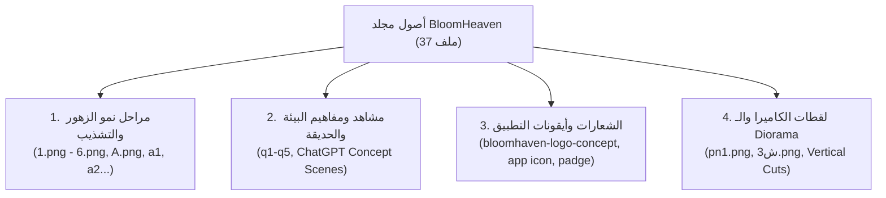

# 🎨 فحص وتحليل الأصول الفنية في `assets/BloomHeaven` وخطة توظيفها

> **الهدف:** فحص شامل ودقيق لكافة الصور والمستندات الفنية في مجلد `assets/BloomHeaven`، استخلاص القواعد الفنية والأسلوب البصري، وتحديد كيفية استخدامها وتعديلها واستكمالها داخل مشروع **Finest Garden** على محرك **Godot 4.7.1** بأعلى درجات التناسق والجودة.

---

## 🔍 1. تحليل الأسلوب الفني المعتمد (Art Style & Visual Identity)

بناءً على الفحص البصري ودليل الإنتاج الفني المرفق (`Bloomhaven — Art Sheet - Production Guide`)، تم استخلاص الركائز البصرية الثابتة:

* **النمط العام:** **Cozy 2.5D Botanical Diorama + Handcrafted Warm Touch** (أسلوب دافئ ومريح، نباتي عضوي مرسوم بعناية، وليس كرتونياً مبالغاً أو واقعياً بارداً).
* **لوحة الألوان (Color Palette):**
  - ألوان ترابية دافئة لقواعد التربة والأحواض (`Terracotta #845B39`, `Rich Loam #3D2E1B`, `Warm Ochre #C9A257`).
  - درجات خضراء ناعمة للسيقان والأوراق (`Sage Green`, `Forest Moss #4A5D23`, `Olive Tone`).
  - ألوان زهرية نقية ودافئة للبتلات (`Crimson Rose`, `Soft Lavender Violet`, `Golden Amber Sunflower`).
* **الإضاءة والظلال (Lighting & Shadows):**
  - زاوية إضاءة ناعمة من الأعلى بزاوية 2.5D دائرية خفيفة.
  - ظلال ناعمة (`Soft Contact Shadow`) عند قاعدة كل نبات لتثبيته في التربة ومنعه من الظهور كأنه يطفو.
* **قاعدة "النبات المتصل بالأرض" (Rooted Plant Rule):**
  - كل سبرايت زهرة يظهر ومعه رقعة التربة الطبيعية (`Soil Patch`) وقاعدة النبات، لتوفير انتقال بصري حي وسلس داخل أحواض الحديقة.

---

## 📊 2. جرد وتصنيف الأصول الموجودة (Asset Breakdown)

يحتوي المجلد على **37 صورة** فنية تم تصنيفها إلى 4 مجموعات رئيسية:



---

### المجموعة 1: أصول مراحل نمو الزهور والتشذيب (Branching Growth Assets)

تمثل التطبيق العملي لدورة النمو المتفرع (Sprout ➔ Young Plant ➔ قرار التشذيب ➔ Cluster / Single):

| اسم الملف | الأبعاد | الصيغة | الوصف والتصنيف داخل اللعبة |
|---|---|---|---|
| `1.png` | 1254x1254 | RGB | **المرحلة 1 (`Sprout`):** بداية خروج البادرة من كومة التربة الدافئة |
| `2.png` | 1254x1254 | RGB | **المرحلة 2 (`Young Plant`):** نمو الأوراق وتكون الساق (لحظة قرار التقليم) |
| `3.png` | 1254x1254 | RGB | **المسار A (`Cluster Bud`):** نمو طبيعي بدون قص وتكون 3 براعم متعددة |
| `4.png` | 1254x1254 | RGBA (شفاف) | **المسار A (`Cluster Bloom`):** تفتح عنقودي طبيعي لـ 3 زهرات متوسطة |
| `5.png` | 1254x1254 | RGBA (شفاف) | **المسار B (`Single Bud`):** بعد التشذيب؛ تركيز الغذاء في برعم واحد ضخم |
| `6.png` | 1254x1254 | RGBA (شفاف) | **المسار B (`Single Bloom`):** زهرة فردية ملكية فاخرة (Hero Bloom ★★★) |
| `A.png`, `a1.png`, `a2.png`, `ٍ.png` | 1254x1254 | RGB / RGBA | نماذج بديلة واستكشافات لسلالات ألوان إضافية وتفرعات نباتية |

---

### المجموعة 2: أصول الهوية والشعارات والواجهة (Branding & UI Assets)

| اسم الملف | الأبعاد | الصيغة | الاستخدام في المشروع |
|---|---|---|---|
| `bloomhaven-logo-concept-v1-1254.png` | 1254x1254 | RGBA (شفاف) | الشعار الرئيسي عالي الدقة لشاشة البداية والـ Splash Screen |
| `bloomhaven-logo-concept-v1-1024.png` | 1024x1024 | RGBA (شفاف) | نسخة الشعار للواجهات وقوائم اللعبة |
| `bloomhaven-logo-concept-v1-512.png` | 512x512 | RGBA (شفاف) | نسخة متوسطة لعناصر القوائم |
| `bloomhaven-logo-concept-v1-256.png` | 256x256 | RGBA (شفاف) | شارة مصغرة للإشعارات |
| `app icon.png` | 1254x1254 | RGB | أيقونة التطبيق الرسمية لبناء نظام Android و Desktop |
| `padge.png` | 1254x1254 | RGB | وسام / إطار لإنجازات اللاعب والأطلس النباتي |

---

### المجموعة 3: مشاهد البيئة والمفاهيم البصرية (Environment & Diorama Concepts)

| الملفات | الأبعاد | الاستخدام البرمجي والتصميمي |
|---|---|---|
| `q1.png` - `q5.png` | 1448x1086 / 1672x941 | لوحات مفاهيم بصرية (Concept Art) لتصميم البيوت الزجاجية (Greenhouses)، أحواض الزهور الحجرية، ومحطة تقطير العطور |
| `ChatGPT Image Aug 22/23 ...` | دقة متعددة | مراجع إضاءة وتكوين لبيئة الحديقة نهاراً وليلاً وزوايا الكاميرا 2.5D |
| `pn1.png` | 1024x1536 (RGBA) | عنصر عمودي شفاف يمثل مشهد ديوراما ومحطة رعاية نباتية |
| `ش3.png` | 1402x1122 | مفهوم ورشة تنسيق الباقات وكشك بيع المارة |

---

## 🛠️ 3. خطة المعالجة والتعديل للاستخدام المباشر في Godot 4.7.1

لتحويل هذه الأصول إلى عناصر جاهزة برمجياً وقابلة للتشغيل بكفاءة عالية على الهواتف والكمبيوتر:

### الخطوة 1: معالجة واستخراج الشفافية (Alpha Masking & De-fringing)
* تحويل الصور ذات الخلفية المصمتة (`1.png`, `2.png`, `3.png`, `A.png`, `a1.png`, `a2.png`) إلى شفافية نقية `RGBA` مع عزل رقعة التربة والنبات بدقة، والتخلص من أي هالات بيضاء على الحواف (`Color De-fringing`).

### الخطوة 2: توحيد المقاييس ونقطة الارتكاز (Scale & Pivot Normalization)
* ضبط نقطة الارتكاز (`Pivot Offset / Anchor`) لتكون **أسفل المركز (Bottom-Center)** عند قاعدة التربة تماماً، مما يضمن أن كل المراحل (من البادرة حتى الزهرة المتفتحة) تنمو بسلاسة وتثبت بدقة فوق أحواض الحديقة.
* تحجيم السبرايتات المعتمدة داخل اللعبة لمقاس قياسي موحد (مثلاً `512x512` أو `256x256`) لتحسين استخدام الذاكرة مع الحفاظ على النسخ الأصلية (Master Assets).

### الخطوة 3: تجميع أطلس الرسوم (Texture Atlas / SpriteSheet Generation)
* دمج السبرايتات الفردية داخل `TextureAtlas` لتقليل استدعاءات الرسم (`Draw Calls`) على محرك Godot 4.7.1 بنمط `GL Compatibility` على هواتف Android.

### الخطوة 4: التسمية المعيارية وربطها بالمحرك
إعادة تسمية وتوزيع الملفات وفق معايير المشروع:
```text
assets/
└── flowers/
    ├── rose/
    │   ├── flower_rose_sprout_v01.png
    │   ├── flower_rose_youngplant_v01.png
    │   ├── flower_rose_bud_cluster_v01.png
    │   ├── flower_rose_bloom_cluster_v01.png
    │   ├── flower_rose_bud_single_v01.png
    │   └── flower_rose_bloom_single_v01.png
    ├── lavender/
    └── sunflower/
```

---

## 🎨 4. خطة استكمال باقي الأصول الفنية (Generating Missing & Future Assets)

لإنتاج باقي الزهور (اللافندر، عباد الشمس، السلالات الهجينة، عناصر الديكور ومحطات العطور والنحل):

1. **الالتزام بـ Flower Identity Sheet:**
   * تحديد مواصفات شكل البتلات، الساق، نوع الورقة، ولون التربة قبل رسم كل نوع جديد.
2. **استخدام نفس أسلوب الإضاءة والفرشاة:**
   * الحفاظ على نعومة الخطوط والإضاءة العلوية لضمان انسجام الزهور الجديدة 100% مع الوردة الأصلية.
3. **تطبيق نظام المراحل الـ 6:**
   * إنتاج 6 سبرايتات لكل زهرة هجينة أو أساسية لدعم ميكانيكية التشذيب (Pruning).
4. **أصول البيئة والتصنيع المستلهمة من Fiona Finch:**
   * استخراج عناصر كشك البيع، خلايا النحل، ومحطة تقطير العطور من لوحات الـ Concept الحالية (`q1`-`q5`, `ش3.png`) وتحويلها إلى كائنات بيئية قابلة للوضع (`Placeable Diorama Entities`).

---

## 🎯 الخلاصة

مجموعة أصول `BloomHeaven` تمثل **ثروة بصرية متكاملة وعالية الجودة** تمنح اللعبة هويتها الخاصة والفريدة. باتباع خطوات المعالجة والتوحيد الموضحة، سنحصل على دورة نمو نباتي حية ومبهرة، مع إمكانية استكمال باقي أنواع الزهور والمحطات بنفس المعيار الفني الرفيع.
