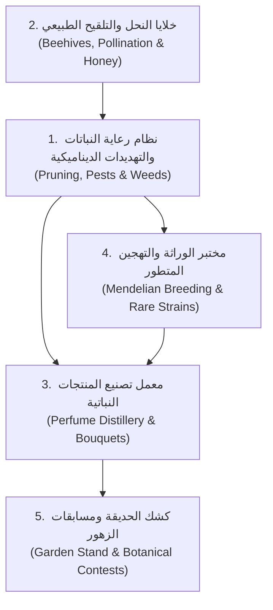

# 🌸 استلهام وتحليل أفكار لعبة *Fiona Finch and the Finest Flowers* لمشروع *Finest Garden*

> **الهدف:** تحليل ميكانيكيات وأنظمة لعبة إدارة الحدائق الكلاسيكية الشهيرة *Fiona Finch and the Finest Flowers* (إنتاج 2010)، واستخراج وتطوير أفكار مبتكرة تناسب مشروعنا **Finest Garden** على محرك **Godot 4.7.1**.

---

## 🔍 1. التحليل المفصل للعبة *Fiona Finch and the Finest Flowers*

لعبة *Fiona Finch* تعتبر واحدة من أبرز وأنجح ألعاب إدارة الحدائق والوقت الكلاسيكية (Time & Resource Management). تميزت بدمج فريد بين **الاستراتيجية والتخطيط الهادئ** و**سرعة الاستجابة للطلبات والآفات**، وتمحورت حول العناصر التالية:

1. **دورة العناية المتكاملة بالنباتات (Holistic Plant Care):**
   - لا تقتصر على الري فقط، بل تشمل: حرث التربة ➔ زرع البذور ➔ الري المنتظم ➔ التغذية بالسماد ➔ **التشذيب والتقليم (Pruning)** ➔ **مكافحة الآفات والأعشاب الضارة** ➔ الحصاد.
2. **آلة التهجين المبتكرة (The Cross-Breeding Machine):**
   - ميكانيكية محورية تتيح دمج نوعين مختلفين من الزهور لإنتاج سلالات نادرة وجديدة (مثل دمج الزنبق مع التوليب لإنتاج *Tiger Lily*)، والتي تباع بأسعار مرتفع وتلبي طلبات خاصة.
3. **سلسلة القيمة المضافة والتصنيع (Value-Add Crafting Chain):**
   - حصاد الزهور لا ينتهي ببيعها كخام؛ بل توجد محطات تصنيع:
     - **تقطير العطور (Perfumes):** استخلاص الزيوت العطرية من بتلات الزهور.
     - **خلايا النحل (Beehives & Honey):** نحل يلقح الحديقة وينتج عسلاً فاخراً.
     - **شجيرات الفاكهة (Berry Bushes & Vines):** زراعة التوت والعنب لإنتاج المربى والعصائر.
4. **المسابقات والمعارض النباتية (Flower Contests & Fairs):**
   - السفر عبر 7 مواقع وحدائق مختلفة، خوض مسابقات زراعية ودفع رسوم دخول لكسب كؤوس وجوائز وتوسيع الحديقة.
5. **نظام الطلبات وكشك البيع (Shed Sales & Timed VIP Orders):**
   - بيع منتظم للمارة في كشك الحديقة، مع ظهور "طلبات خاصة محددة الوقت" تتطلب دقة وسرعة للحصول على مكافآت ضخمة.
6. **غياب الضغط الزمني القسري في المستويات العادية:**
   - المستويات لا تنتهي بمؤقت موت مفاجئ، بل تكتمل بتحقيق أهداف الجودة والإنتاج، مما يمنح إحساساً مريحاً ومجزياً بالتخطيط.

---

## 💡 2. الأفكار والأنظمة الجديدة المستلهمة لمشروعنا *Finest Garden*

قمنا بتطوير هذه المفاهيم وصياغتها في أنظمة لعب عصرية متكاملة قابلة للتنفيذ في **Godot 4.7.1**:

---

### 🌿 الفكرة 1: نظام التهديدات الديناميكية والعناية المتقدمة (Dynamic Care & Threats)

* **التشذيب والتقليم (Pruning Mechanic):**
  - تظهر أوراق ذابلة عشوائياً على الزهرة في مرحلة النمو 3.
  - استخدام أداة المقص لإزالة الأوراق الذابلة يمنح الزهرة **نجمة جودة (Quality Tier: ★★★)**، مما يرفع سعر بيعها بنسبة +50%.
* **الأعشاب الضارة الطفيلية (Invasive Weeds):**
  - تظهر أعشاب ضارة بين الأحواض تمتص رطوبة التربة بمعدل 3x.
  - إزالتها السريعة باليد يمنح اللاعب سماداً عضوياً طبيعياً.
* **حشرات الحديقة (Garden Insects & Butterflies):**
  - **حشرات ضارة (Aphids):** تبطئ النمو، يتم رشها برذاذ طبيعي (Eco-Spray).
  - **فراشات نافعة:** تزيد من فرصة حدوث طفرات جينية نادرة إذا هبطت على الزهرة أثناء تفتحها.

---

### 🐝 الفكرة 2: خلايا النحل وإنتاج العسل النباتي (Beehives & Floral Honey)

* **مبنى خلية النحل (Placeable Beehive):**
  - عنصر بيئي يمكن للاعب شراؤه ووضعه في زاوية الحديقة.
  - يخرج النحل تلقائياً ليحوم حول الأحواض المزهرة.
* **تأثير التلقيح المتبادل (Cross-Pollination Buff):**
  - إذا حام النحل بين حوضين متجاورين لزهور مختلفة (مثل Rose و Sunflower)، ترتفع فرصة الحصول على بذور هجينة تلقائياً بنسبة 25% عند الحصاد!
* **حصاد العسل الموسمي (Floral Honey):**
  - يمتلئ قرص العسل كل فترة بناءً على نوع الزهور المزروعة (عسل الورد، عسل اللافندر المهدئ، عسل عباد الشمس الذهبي)، ويباع بسعر مرتفع.

---

### 🧪 الفكرة 3: معمل تقطير العطور والزيوت العطرية (Perfume Distillery)

* **محطة التقطير (Distillery Station):**
  - محطة تفاعلية في الحديقة (مشابهة لورشة الباقات).
  - يضع اللاعب 3 زهور مقطوفة من سلالات معينة لاستخلاص زجاجة عطر فاخرة:
    - *3x Lavender* ➔ **Calming Lavender Mist** (زيت الاسترخاء).
    - *2x Red Rose + 1x Roselight* ➔ **Luminous Velvet Elixir** (عطر النور المخملي).
    - *2x Golden Rose + 1x Sunflower* ➔ **Solar Essence** (عطر شمس الضحى).
* **قيمة مضافة عالية:** العطور مطلوبة بشدة من كبار الزبائن والمتاجر الفاخرة بأسعار تفوق بيع الزهور المفردة.

---

### 🏆 الفكرة 4: معارض ومسابقات الزهور الإقليمية (Botanical Contests & Fairs)

* **نظام الكؤوس والمنافسات (Garden Cups):**
  - في نهاية كل موسم أو مرحلة، يمكن للاعب الاشتراك في "معرض زهور الربيع" أو "كأس الملقح الذهبي".
  - شروط المسابقة تتطلب تقديم:
    1. باقة محددة بمواصفات جودة (★★★).
    2. زهرة هجينة نادرة من الجيل الثاني (G2).
    3. زجاجة عطر نقية.
* **المكافآت:**
  - فتح أدوات ذهبية أسرع (Golden Watering Can, Pro Pruner).
  - فتح أراضٍ وأحواض زراعية جديدة وتصميمات ديكور حصرية.

---

### 🏪 الفكرة 5: كشك الحديقة والطلبات الخاصة العاجلة (Garden Stand & VIP Orders)

* **كشك بيع المارة (The Roadside Stand):**
  - منصة في مقدمة الحديقة يضع فيها اللاعب منتجاته (زهور، عسل، عطور، باقات).
  - تمر شخصيات زوار (NPCs) لطيفة وتشتري تلقائياً مع سماع صوت رنين العملات.
* **الطلبات الخاصة العاجلة (Timed Florist & VIP Orders):**
  - يظهر رسول أو زبون VIP يطلب طلباً استثنائياً (مثال: *"حفل زفاف في القرية يحتاج 2 باقة Harmony و 1 عطر اللافندر خلال 3 دقائق"*).
  - إكمال الطلب في الوقت المحدد يمنح مكافأة مضاعفة ونقاط سمعة (Reputation XP).

---

## 🏗️ 3. كيفية دمج هذه الأفكار في معمارية Godot 4.7.1

| النظام المستهدف | مسار الملف المقترح | المسؤولية البرمجية |
|---|---|---|
| **نظام التشذيب والآفات** | `scripts/garden/garden_pest_manager.gd` | إدارة ظهور الأعشاب والآفات، وإشارات التقليم ونجمات الجودة |
| **نظام خلايا النحل** | `scripts/garden/beehive_component.gd` | محاكاة سلوك النحل بالجسيمات (Particles)، وزيادة سرعة النمو والتلقيح |
| **معمل العطور** | `scripts/crafting/perfume_distillery.gd` | وصفات تقطير العطور وحساب القيمة المضافة ومطابقة المكونات |
| **مسابقات الزهور** | `scripts/quests/botanical_contest_manager.gd` | إدارة شروط التقديم في المعارض، تقييم الجودة، وتوزيع الكؤوس |
| **كشك البيع والزبائن** | `scripts/economy/garden_shop_stand.gd` | بيع المنتجات السلبي للمارة وتوليد دخل دوري |

---

## 🎯 الخلاصة

بهذه الإضافات المستلهمة من *Fiona Finch*، تتحول **Finest Garden** من مجرد نموذج أولي لزراعة الزهور إلى **تجربة ألعاب متكاملة وممتعة للغاية (Engaging Simulation & Management Loop)** تجمع بين:
1. متعة الزراعة والتشذيب اليومي.
2. عمق الوراثة والتهجين العلمي.
3. متعة التصنيع (عطور، باقات، عسل).
4. فخر الفوز بالمسابقات وتطوير الحديقة إلى ملاذ نباتي خلاب.
